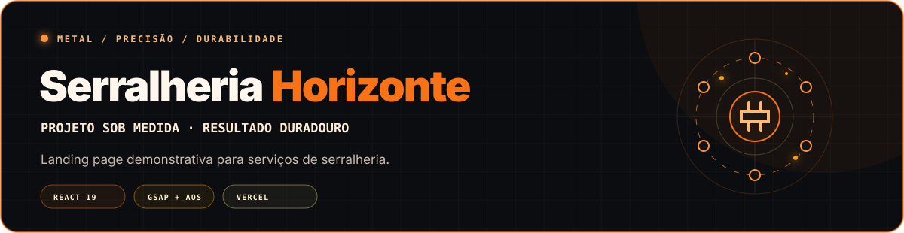

<div align="center">
  
</div>

<div align="center">

[](https://react.dev/)
[](https://vite.dev/)
[](https://gsap.com/)
[](https://michalsnik.github.io/aos/)
[](https://vercel.com/)

[**Acessar projeto publicado**](https://serralheria-inky.vercel.app/)

</div>

## Sobre o projeto

Landing page demonstrativa desenvolvida para apresentar os serviços da marca fictícia **Serralheria Horizonte**.

O projeto combina identidade visual industrial, animações e chamadas para contato com o objetivo de demonstrar como uma presença digital pode transformar visitas em pedidos de orçamento. Todos os nomes e dados de contato usados na interface são fictícios.

## Demonstração

<div align="center">
  <a href="https://serralheria-inky.vercel.app/">
    
  </a>
</div>

## Experiência da página

| Seção | Recursos |
|---|---|
| **Header** | Menu fixo, mudança visual durante o scroll e navegação mobile |
| **Hero** | Apresentação do serviço, animações GSAP e chamada para orçamento |
| **Serviços** | Cards interativos e modal com detalhes de cada solução |
| **Portfólio** | Filtros por categoria e visualização ampliada dos trabalhos |
| **Diferenciais** | Materiais, experiência e compromisso com prazos |
| **Depoimentos** | Carrossel automático com controles manuais |
| **Sobre** | História do profissional e apoio visual em vídeo |
| **Contato** | WhatsApp com mensagem pronta e informações de atendimento |

## Serviços apresentados

- Portões automáticos
- Grades e guarda-corpos
- Estruturas metálicas
- Móveis em metal sob medida

## Tecnologias

```text
Interface    React 19 · JavaScript · CSS
Animações    GSAP · ScrollTrigger · AOS · Framer Motion
Ícones       React Icons
Build        Vite 8
Qualidade    ESLint 9
Deploy       Vercel
```

## Como executar

### Pré-requisitos

- Node.js 22 ou superior
- npm

### Instalação

```bash
git clone https://github.com/Julio5630/Serralheria.git
cd Serralheria/Serralheria
npm install
```

### Desenvolvimento

```bash
npm run dev
```

### Qualidade e produção

```bash
npm run lint
npm run build
npm run preview
```

## Estrutura

```text
Serralheria/
├── public/
│   ├── images/          # Portfólio e clientes
│   ├── videos/          # Mídias de fundo
│   ├── favicon.svg
│   └── icons.svg
├── src/
│   ├── components/
│   │   ├── About.jsx
│   │   ├── Contact.jsx
│   │   ├── Differentials.jsx
│   │   ├── Footer.jsx
│   │   ├── Header.jsx
│   │   ├── Hero.jsx
│   │   ├── Portfolio.jsx
│   │   ├── ServiceModal.jsx
│   │   ├── Services.jsx
│   │   └── Testimonials.jsx
│   ├── App.jsx
│   └── main.jsx
├── vercel.json
├── package.json
└── vite.config.js
```

## Decisões de implementação

- Componentes independentes para cada seção da landing page
- Conteúdo de serviços e portfólio modelado em coleções JavaScript
- Estado local para filtros, modais, menu e carrossel
- Animações acionadas por entrada e posição de scroll
- Links externos protegidos com `noopener noreferrer`
- Rewrite da Vercel para navegação da aplicação

## Antes de publicar como produto final

- [ ] Adicionar ao repositório todas as imagens usadas pelo portfólio
- [ ] Corrigir a referência do vídeo `sparks.mp4` ou usar o vídeo existente
- [ ] Substituir depoimentos e fotografias demonstrativas por conteúdo autorizado
- [ ] Revisar e padronizar os números de WhatsApp exibidos
- [ ] Configurar links reais de Instagram e Facebook
- [ ] Atualizar título, descrição, Open Graph e idioma do HTML
- [ ] Otimizar imagens e vídeo para desempenho
- [ ] Adicionar testes de componentes e acessibilidade

## Contexto

O projeto foi criado como estudo de uma presença digital para pequenos negócios. O desenvolvimento contou com orientação do professor [Hudson Neves](https://github.com/HudsonNeves).

## Autor

Desenvolvido por [Júlio César](https://github.com/Julio5630).
